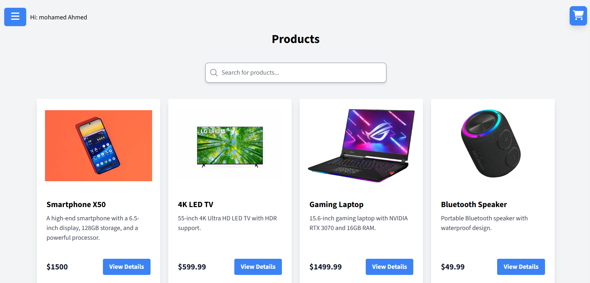
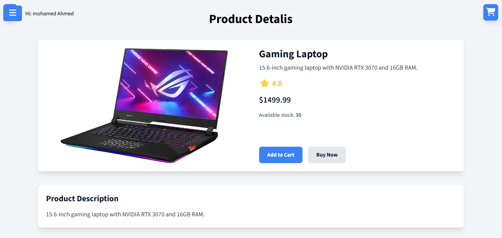
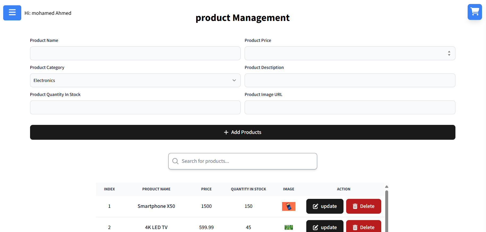

<h1>Markato</h1>

<h4 align="center">A Store & Business Management Software built with <a href="https://react.dev/" target="_blank">React</a>.</h4>

  <a href="#key-features">Key Features</a> •
  <a href="#Technologies">Technologies</a> •
  <a href="#license">License</a>

  

## Key Features

- Customer Experience
  - Make purchsases, Update cart and view items and checkout.
- Owner Experience
  - Manage receipts.
- Manage Inventory
  - Add remove and update them.
  - Update Stock levels and Categories
- Cloud Database
  - All data secured with cloud backup.
- Multiuser support
- Diffrent users permissions based on the user type (Admin, Normal User)

* Users for testing: 
  - admin: admin@gmail.com, 123123aa
  - user: newuser@gmail.com, 123123aa
## Technologies

- ReactJS, React Router, TailwindCSS, FontAwesome Axiso, ContextAPI, NodeJS, ExpressJS, MongoDB, MongooseDB, Bcrypt.

## License

Mohamed Sayed Abdelaal mohamedsayedabdelaal1@gmail.com

---

> [LinkedIn](https://www.linkedin.com/in/mohamed-sayed-abdalaa) &nbsp;&middot;&nbsp; [Whatsapp](https://wa.me/+201151134462) &nbsp;&middot;&nbsp; GitHub [@msabdalaal](https://github.com/msabdalaal) &nbsp;&middot;&nbsp;
